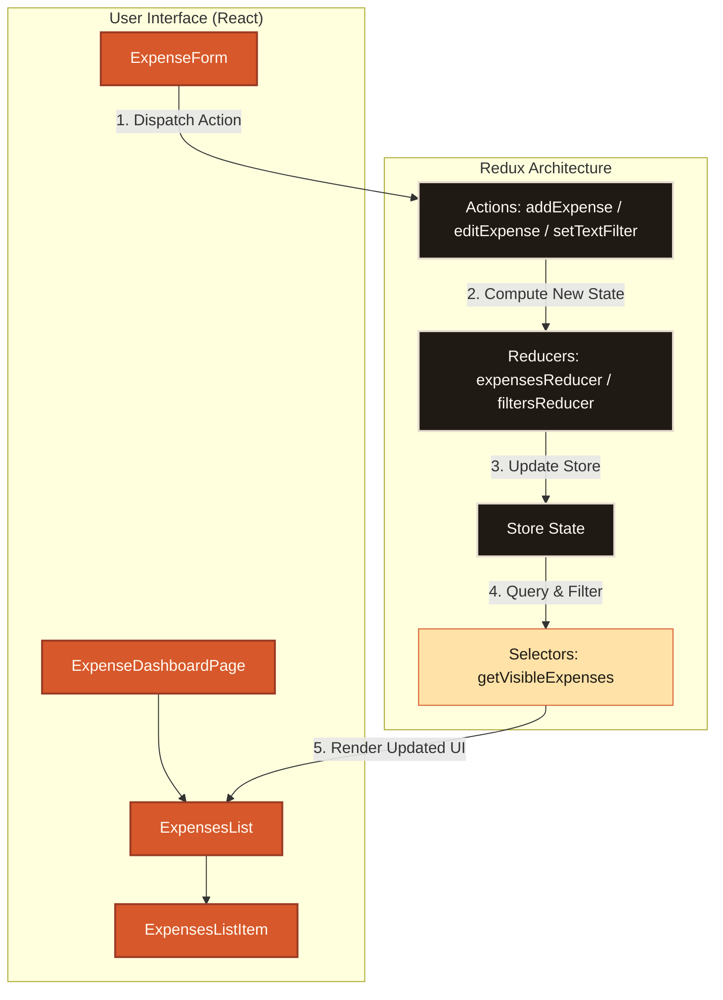

# 💵 Monety


<p align="center">
  
  
  
  
  
  
</p>

---

## 🎨 Overview
**Monety** is a premium, responsive expense tracking application built using a modern React & Redux state architecture. The interface is meticulously designed around a warm terracotta-sand theme featuring customized typography (*Space Grotesk* for UI text and *Fraunces* for editorial headers), smooth gradients, and tactile shadows.

---

## ✨ Features
*   ➕ **Expense Control** — Quickly create, view details of, modify, or delete single expenses.
*   🔍 **Smart Dynamic Filtering** — Filter your expense timeline seamlessly by text queries or date ranges.
*   ⚡ **Date Range Shortcuts** — Hop between custom recent spending ranges (e.g. today, this week, this month) using optimized dates UI.
*   ↕️ **Sorting Mechanics** — Sort transactions dynamically by amount or date.
*   🧩 **Help Desk & Tech Breakdown** — An interactive onboarding section breaking down app features and core architecture.

---

## 🏗️ Architecture & Data Flow
Monety implements a clean unidirectional data flow via Redux. Here is how components communicate with the central store:



---

## 🚀 Getting Started

### 1. Install Dependencies
Initialize the project environment locally:
```bash
npm install
```

### 2. Run the Development Server
Starts the React development environment with hot-reloading active:
```bash
npm run dev-server
```

### 3. Production Compilation
Compiles, minifies, and bundles assets into the `/public` directory:
```bash
npm run build
```

### 4. Running Test Suites
Execute full Jest tests:
```bash
npm test
```

---

## 🌐 Netlify Deployment Guide
Monety contains an optimized [netlify.toml](file:///D:/02-Projects/02-Deployed/01-Production/Monety-master/netlify.toml) configured to deploy and handle SPA routing rules seamlessly.

### Option A: Continuous Deployment (Recommended)
1. Commit your codebase and push to GitHub, GitLab, or Bitbucket.
2. Log in to [Netlify](https://www.netlify.com/).
3. Click **Add new site** > **Import an existing project** and link your repository.
4. Netlify will auto-read [netlify.toml](file:///D:/02-Projects/02-Deployed/01-Production/Monety-master/netlify.toml) configurations.
5. Click **Deploy**.

### Option B: Netlify CLI
Directly publish from your terminal using configured npm scripts in [package.json](file:///D:/02-Projects/02-Deployed/01-Production/Monety-master/package.json):
```bash
# Install Netlify CLI globally
npm install -g netlify-cli

# Login and link to your Netlify account
npm run netlify:link

# Deploy the generated build directory
npm run netlify:deploy
```

### Option C: Manual Drop
1. Run `npm run build` locally.
2. Drag and drop the `/public` directory onto the [Netlify Drop](https://app.netlify.com/drop) dashboard.
