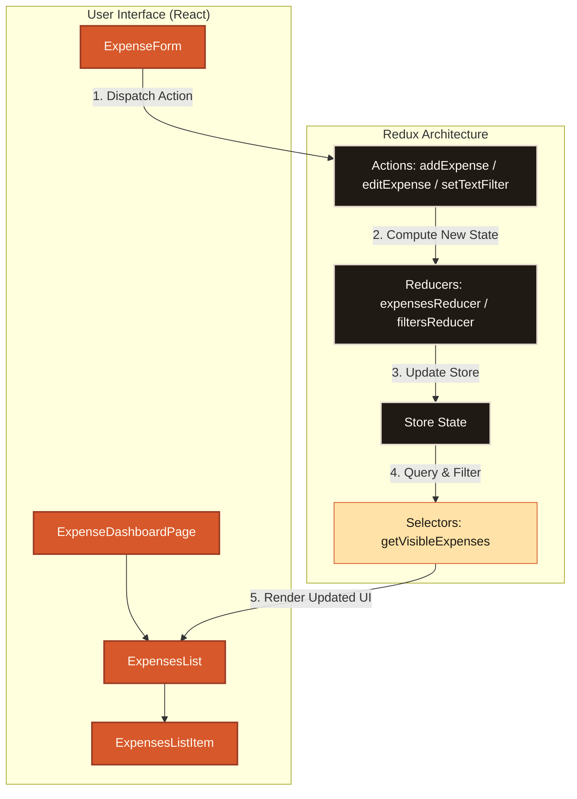

<p align="center">
  <svg width="800" height="220" viewBox="0 0 800 220" fill="none" xmlns="http://www.w3.org/2000/svg">
    <!-- Gradient definition -->
    <defs>
      <linearGradient id="sand-grad" x1="0%" y1="0%" x2="100%" y2="100%">
        <stop offset="0%" stop-color="#fffaf2"/>
        <stop offset="60%" stop-color="#f4efe6"/>
        <stop offset="100%" stop-color="#fcebcf"/>
      </linearGradient>
      <filter id="shadow" x="-5%" y="-5%" width="110%" height="110%">
        <feDropShadow dx="2" dy="6" stdDeviation="8" flood-color="#422205" flood-opacity="0.08"/>
      </filter>
    </defs>
    
    <!-- Background Card -->
    <rect width="800" height="220" rx="20" fill="url(#sand-grad)" filter="url(#shadow)"/>
    
    <!-- Decorative Terracotta Accents -->
    <circle cx="700" cy="180" r="120" fill="#fee2a8" opacity="0.3"/>
    <circle cx="80" cy="50" r="90" fill="#f4c8a2" opacity="0.25"/>
    <path d="M 640 0 C 680 40, 720 30, 800 50 L 800 0 Z" fill="#d7582b" opacity="0.08"/>
    
    <!-- Logo / Coin Vector -->
    <g transform="translate(70, 75)">
      <!-- Golden Glow -->
      <circle cx="40" cy="40" r="32" fill="#fee2a8"/>
      <!-- Terracotta Wallet / Coin base -->
      <rect x="20" y="30" width="45" height="30" rx="6" fill="#d7582b"/>
      <path d="M 30 30 L 30 20 C 30 16, 36 12, 42 12 C 48 12, 54 16, 54 20 L 54 30" stroke="#9a3b24" stroke-width="4" stroke-linecap="round" fill="none"/>
      <!-- Metallic Coin -->
      <circle cx="42" cy="20" r="10" fill="#fee2a8" stroke="#d7582b" stroke-width="3"/>
      <circle cx="42" cy="20" r="5" fill="#d7582b"/>
    </g>

    <!-- Typography -->
    <!-- Title "MONETY" -->
    <text x="175" y="115" font-family="Fraunces, Georgia, serif" font-size="64" font-weight="bold" fill="#1f1a14" letter-spacing="4">M O N E T Y</text>
    <!-- Subtitle / Tagline -->
    <text x="178" y="152" font-family="Space Grotesk, Trebuchet MS, sans-serif" font-size="16" font-weight="500" fill="#5a534a">A gorgeous React &amp; Redux-powered expense management system.</text>
    
    <!-- Small Status Tag -->
    <rect x="178" y="45" width="95" height="22" rx="11" fill="#d7582b"/>
    <text x="225" y="60" font-family="Space Grotesk, Trebuchet MS, sans-serif" font-size="10" font-weight="bold" fill="#fffaf2" text-anchor="middle">v1.0.0 ACTIVE</text>
  </svg>
</p>

<p align="center">
  
  
  
  
  
  
</p>

---

## 🎨 Overview
**Monety** is a premium, responsive expense tracking application built using a modern React & Redux state architecture. The interface is meticulously designed around a warm terracotta-sand theme featuring customized typography (*Space Grotesk* for UI text and *Fraunces* for editorial headers), smooth gradients, and tactile shadows.

---

## ✨ Features
*   ➕ **Expense Control** — Quickly create, view details of, modify, or delete single expenses.
*   🔍 **Smart Dynamic Filtering** — Filter your expense timeline seamlessly by text queries or date ranges.
*   ⚡ **Date Range Shortcuts** — Hop between custom recent spending ranges (e.g. today, this week, this month) using optimized dates UI.
*   ↕️ **Sorting Mechanics** — Sort transactions dynamically by amount or date.
*   🧩 **Help Desk & Tech Breakdown** — An interactive onboarding section breaking down app features and core architecture.

---

## 🏗️ Architecture & Data Flow
Monety implements a clean unidirectional data flow via Redux. Here is how components communicate with the central store:



---

## 🚀 Getting Started

### 1. Install Dependencies
Initialize the project environment locally:
```bash
npm install
```

### 2. Run the Development Server
Starts the React development environment with hot-reloading active:
```bash
npm run dev-server
```

### 3. Production Compilation
Compiles, minifies, and bundles assets into the `/public` directory:
```bash
npm run build
```

### 4. Running Test Suites
Execute full Jest tests:
```bash
npm test
```

---

## 🌐 Netlify Deployment Guide
Monety contains an optimized [netlify.toml](file:///D:/02-Projects/02-Deployed/01-Production/Monety-master/netlify.toml) configured to deploy and handle SPA routing rules seamlessly.

### Option A: Continuous Deployment (Recommended)
1. Commit your codebase and push to GitHub, GitLab, or Bitbucket.
2. Log in to [Netlify](https://www.netlify.com/).
3. Click **Add new site** > **Import an existing project** and link your repository.
4. Netlify will auto-read [netlify.toml](file:///D:/02-Projects/02-Deployed/01-Production/Monety-master/netlify.toml) configurations.
5. Click **Deploy**.

### Option B: Netlify CLI
Directly publish from your terminal using configured npm scripts in [package.json](file:///D:/02-Projects/02-Deployed/01-Production/Monety-master/package.json):
```bash
# Install Netlify CLI globally
npm install -g netlify-cli

# Login and link to your Netlify account
npm run netlify:link

# Deploy the generated build directory
npm run netlify:deploy
```

### Option C: Manual Drop
1. Run `npm run build` locally.
2. Drag and drop the `/public` directory onto the [Netlify Drop](https://app.netlify.com/drop) dashboard.
